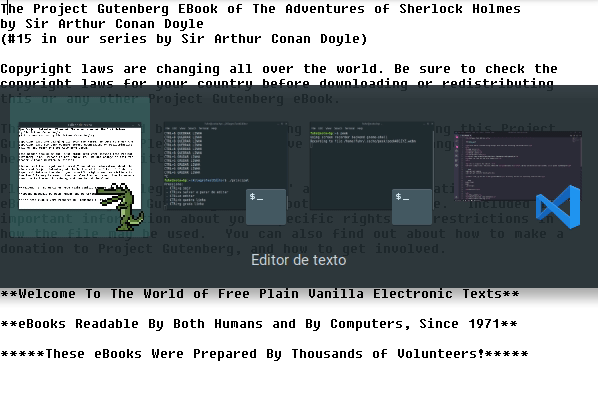

<h1> Allegro Text Editor </h1>



<p>A text editor created using Allegro that has the following functionalities.</p>
<ul>
<li>Add text</li>
<li>Remove text</li>
<li>Break lines</li>
<li>Concatenate rows</li>
<li>Scroll the screen along the text (Downwards and upwards)</li>
<li>Save the text on the file saida.txt</li>
</ul>

<h2> How to compile the editor: </h2>
<p>First things first! You will need the <strong>allegro 5</strong> library installed in your system, it is quite lightweigth:</p>

```bash
sudo apt-get update
sudo apt-get install liballegro5-dev
```
<p>After that, go to the <i>AllegroTextEditor</i> directory and do the following instructions:</p>

```bash
make clean
make
./principal
```
<h2>Controls:</h2>

<ul>
<li>CTRL+q EXIT</li>
<li>CTRL+s Save and stop editing</li>
<li>CTRL+e Start editing </li>
<li>CTRL+b Split line on the cursor</li>
<li>CTRL+g Concatenate lines</li>
<li>ARROW-KEYS Cursor movement</li>
</ul> 
